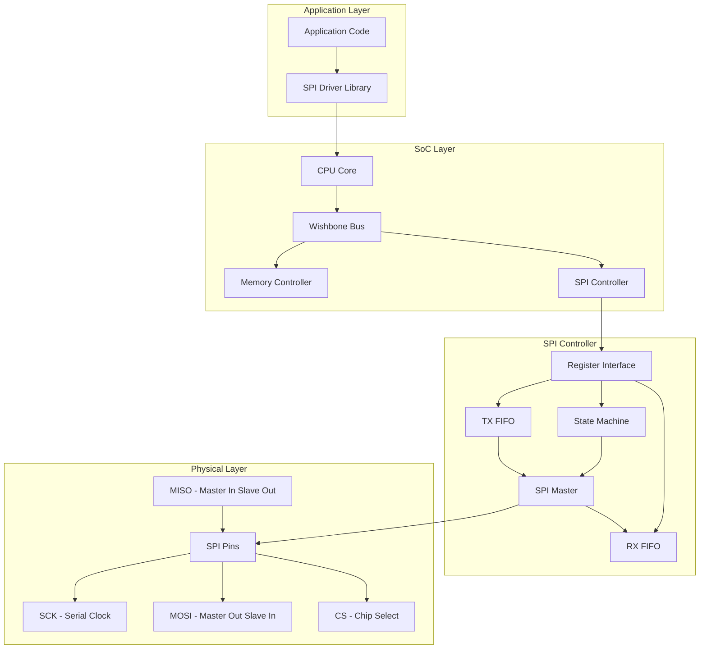
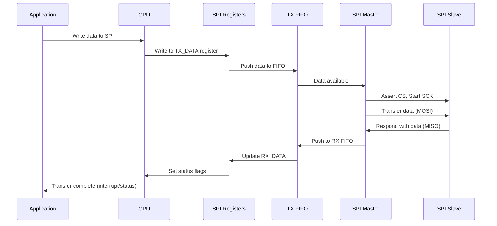

# SPI Communication System on Chip (SoC) Project

[](https://opensource.org/licenses/MIT)
[](https://www.verilog.org/)
[](https://en.cppreference.com/w/c/99)
[]()
[](http://iverilog.icarus.com/)
[](https://yosyshq.net/yosys/)

A complete, production-ready implementation of a SPI (Serial Peripheral Interface) communication system with a configurable System-on-Chip (SoC) design. This project provides a hardware-software co-design solution for embedded systems requiring SPI communication.

##  Table of Contents

- [Overview](#-overview)
- [Features](#-features)
- [Architecture](#-architecture)
- [ System Flow](#-system-flow)
- [ Getting Started](#-getting-started)
  - [Prerequisites](#prerequisites)
  - [Installation](#installation)
  - [Quick Start](#quick-start)
- [ Testing](#-testing)
- [ Project Structure](#-project-structure)
- [ Configuration](#-configuration)
- [ Documentation](#-documentation)
- [ Contributing](#-contributing)


##  Overview

This project implements a fully-featured SPI communication system consisting of:

- **Hardware**: Verilog RTL implementation of SPI master/slave controllers with Wishbone bus interface
- **Firmware**: C driver library for easy integration with embedded applications
- **Testbench**: Comprehensive verification environment with simulation testbenches
- **SoC Integration**: Complete System-on-Chip design with CPU, memory, and SPI peripheral

SPI (Serial Peripheral Interface) is a synchronous serial communication protocol used for short-distance communication, primarily in embedded systems between microcontrollers and peripheral devices.

##  Features

###  Core Features
- **Full SPI Mode Support**: Modes 0, 1, 2, and 3 (CPOL/CPHA combinations)
- **Configurable Clock Rates**: Programmable clock divider for flexible SPI frequencies
- **Multiple Chip Selects**: Support for up to 4 slave devices
- **FIFO Buffering**: 8-byte FIFOs for efficient data transfer
- **Interrupt Support**: Configurable interrupt generation for transfer completion
- **Loopback Mode**: Built-in self-test capability

###  Hardware Features
- **Memory-Mapped Registers**: Wishbone-compatible bus interface
- **Register Bank**:
  - Control/Status registers
  - Transmit/Receive data registers
  - Clock configuration register
  - FIFO access registers
- **Error Detection**: Transfer error flags and status monitoring
- **Synchronization**: Double synchronization for metastability protection

###  Software Features
- **Complete C Driver API**: Easy-to-use library for application development
- **Example Applications**: Ready-to-run test programs
- **SPI Flash Support**: Example driver for common SPI flash memories
- **Performance Testing**: Built-in benchmarking tools

###  Verification Features
- **Testbenches**: Complete simulation environment for master and slave
- **Waveform Generation**: VCD files for debugging and analysis
- **Self-Checking Tests**: Automated test verification
- **Code Coverage**: Support for coverage analysis

##  Architecture

### System Block Diagram



### Detailed Architecture

#### 1. **SoC Top-Level (`top.v`)**
   - Integrates CPU, memory, and SPI controller
   - Wishbone bus interface for communication
   - Clock and reset management
   - GPIO for testing and status indication

#### 2. **SPI Controller (`spi_controller.v`)**
   - Memory-mapped register interface (32-bit Wishbone)
   - Register map with 8 accessible registers
   - Interrupt generation logic
   - FIFO management and control

#### 3. **SPI Master (`spi_master.v`)**
   - Core SPI protocol implementation
   - Configurable modes (CPOL, CPHA)
   - Clock generation with programmable divider
   - Data shifting and sampling logic
   - Chip select management

#### 4. **SPI Slave (`spi_slave.v`)**
   - Slave-side SPI implementation
   - Data reception and transmission
   - Synchronization for external signals
   - Error detection and handling

#### 5. **Firmware Driver (`spi_driver.c/h`)**
   - C library for application programming
   - High-level API for SPI operations
   - Device-specific drivers (SPI Flash, etc.)
   - Utility functions and helpers

### Register Map

| Address | Register | Description | Access |
|---------|----------|-------------|---------|
| 0x00 | CONTROL | Control register (start, mode, CS select) | R/W |
| 0x04 | STATUS | Status register (busy, done, FIFO status) | R |
| 0x08 | TX_DATA | Transmit data register | W |
| 0x0C | RX_DATA | Receive data register | R |
| 0x10 | CLK_DIV | Clock divider register | R/W |
| 0x14 | TX_FIFO | Transmit FIFO access | W |
| 0x18 | RX_FIFO | Receive FIFO access | R |
| 0x1C | IRQ_EN | Interrupt enable register | R/W |
| 0x20 | VERSION | Version register (read-only) | R |

##  System Flow

### Data Transfer Flow



### SPI Mode Timing

```
Mode 0 (CPOL=0, CPHA=0):
        _____       _____       _____
SCK  ___|   |_______|   |_______|   |____
       ↑     ↑     ↑     ↑     ↑     ↑
MOSI  MSB   ...   ...   ...   ...   LSB
MISO  MSB   ...   ...   ...   ...   LSB

Mode 1 (CPOL=0, CPHA=1):
        _____       _____       _____
SCK  ___|   |_______|   |_______|   |____
         ↑     ↑     ↑     ↑     ↑     ↑
MOSI    MSB   ...   ...   ...   ...   LSB
MISO    MSB   ...   ...   ...   ...   LSB

Mode 2 (CPOL=1, CPHA=0):
         _____       _____       _____
SCK  ____|   |_______|   |_______|   |___
       ↑     ↑     ↑     ↑     ↑     ↑
MOSI  MSB   ...   ...   ...   ...   LSB
MISO  MSB   ...   ...   ...   ...   LSB

Mode 3 (CPOL=1, CPHA=1):
         _____       _____       _____
SCK  ____|   |_______|   |_______|   |___
         ↑     ↑     ↑     ↑     ↑     ↑
MOSI    MSB   ...   ...   ...   ...   LSB
MISO    MSB   ...   ...   ...   ...   LSB
```

##  Getting Started

### Prerequisites

**Hardware Simulation:**
- [Icarus Verilog](http://iverilog.icarus.com/) (≥ 10.0)
- [GTKWave](http://gtkwave.sourceforge.net/) (for waveform viewing)

**Synthesis:**
- [Yosys](https://yosyshq.net/yosys/) (≥ 0.9)
- [nextpnr](https://github.com/YosysHQ/nextpnr) (optional, for FPGA)

**Software Development:**
- GCC or compatible C compiler
- Make build system

**Documentation:**
- [Pandoc](https://pandoc.org/) (for PDF generation)

### Installation

#### Install Dependencies (Ubuntu/Debian)
```bash
# Install simulation tools
sudo apt-get install iverilog gtkwave

# Install synthesis tools
sudo apt-get install yosys

# Install development tools
sudo apt-get install build-essential git

# Install documentation tools
sudo apt-get install pandoc texlive-latex-base
```

#### Install Dependencies (macOS)
```bash
# Using Homebrew
brew install icarus-verilog gtkwave yosys gcc pandoc
```

### Quick Start

#### 1. Build Everything
```bash
make all
```

#### 2. Run Simulation
```bash
make sim
```

#### 3. View Waveforms
```bash
make view-master  # For SPI master waveforms
make view-slave   # For SPI slave waveforms
```

#### 4. Build Firmware
```bash
make firmware
```

#### 5. Run Example Application
```bash
cd build
./spi_test.elf
```

##  Testing

### Running Tests

#### Unit Tests
```bash
# Run all simulation tests
make test

# Run specific testbench
cd build
vvp spi_master_tb
vvp spi_slave_tb
```

#### Firmware Tests
```bash
# Build and run firmware tests
make firmware
cd build
./spi_test.elf
```

### Test Coverage

The project includes comprehensive test coverage:

1. **Protocol Tests**: All SPI modes (0-3)
2. **Timing Tests**: Various clock divider settings
3. **Data Tests**: Edge case data patterns
4. **Error Tests**: Error condition simulation
5. **Integration Tests**: Full SoC simulation

### Adding New Tests

1. Create testbench in `src/testbench/`
2. Add test patterns in Verilog
3. Update Makefile if needed
4. Run with `make sim`

##  Configuration

### SPI Mode Configuration

```c
// Example: Configure SPI for Mode 0, 1MHz clock
spi_init(SPI_MODE_0, 25);  // 50MHz / (2*25) = 1MHz
```

### Register Configuration Example

```verilog
// Example: Start SPI transfer
control_reg = {24'b0, 
               1'b0,    // CS_POL
               1'b0,    // LOOPBACK
               1'b0,    // DMA_EN
               1'b0,    // IRQ_EN
               2'b00,   // CS_SEL
               2'b00,   // MODE (Mode 0)
               1'b1};   // START
```

### Clock Divider Calculation

```
SPI_SCK_Frequency = System_Clock_Frequency / (2 * CLK_DIV)

Example:
System Clock = 50 MHz
CLK_DIV = 25
SPI_SCK = 50 MHz / (2 * 25) = 1 MHz
```

##  Documentation

### Building Documentation

```bash
# Generate PDF documentation
make docs

# View generated documentation
cd build/docs
ls -la
```

### Available Documentation

1. **Architecture Guide** (`docs/architecture.md`)
   - System block diagrams
   - Register map details
   - Interface specifications

2. **Protocol Specification** (`docs/protocol.md`)
   - SPI timing diagrams
   - Mode descriptions
   - Error handling

3. **API Reference** (generated)
   - C driver function documentation
   - Example code snippets
   - Error code definitions

### Code Documentation

The code includes detailed comments following these standards:
- **Verilog**: Module headers with parameter descriptions
- **C**: Doxygen-style comments for API functions
- **Makefile**: Target descriptions and usage

##  Contributing

We welcome contributions! Please follow these steps:

### Contribution Process

1. **Fork** the repository
2. **Create a feature branch** (`git checkout -b feature/AmazingFeature`)
3. **Commit changes** (`git commit -m 'Add some AmazingFeature'`)
4. **Push to branch** (`git push origin feature/AmazingFeature`)
5. **Open a Pull Request**

### Development Guidelines

#### Code Style
- **Verilog**: Use lowercase for signals, uppercase for parameters
- **C**: Follow ANSI C99 with 4-space indentation
- **Comments**: Document all non-trivial logic

#### Testing Requirements
- All new features must include testbenches
- Maintain or improve code coverage
- Update documentation for API changes

#### Commit Message Format
```
type(scope): subject

body

footer
```

Types: `feat`, `fix`, `docs`, `style`, `refactor`, `test`, `chore`

### Issue Reporting

Found a bug or have a feature request? [Open an issue](https://github.com/yourusername/spi-communication-project/issues) with:
- Clear description
- Steps to reproduce (for bugs)
- Expected vs actual behavior
- Environment details


### Acknowledgments

- Inspired by industry-standard SPI implementations
- Built with open-source tools
- Community-driven development

---

##  Quick Reference

### Common Commands

| Command | Description |
|---------|-------------|
| `make all` | Build everything |
| `make sim` | Run simulations |
| `make firmware` | Build firmware |
| `make clean` | Clean build files |
| `make help` | Show all targets |

### SPI Configuration Cheatsheet

| Mode | CPOL | CPHA | Description |
|------|------|------|-------------|
| 0 | 0 | 0 | Clock idle low, sample on rising edge |
| 1 | 0 | 1 | Clock idle low, sample on falling edge |
| 2 | 1 | 0 | Clock idle high, sample on falling edge |
| 3 | 1 | 1 | Clock idle high, sample on rising edge |

### Common Issues

1. **Simulation fails**: Check Icarus Verilog installation
2. **Waveforms not showing**: Install GTKWave
3. **Firmware won't compile**: Check GCC installation
4. **SPI timing issues**: Verify clock divider settings

---

<div align="center">
  <strong>Happy Coding! </strong>
</div>

<p align="center">
  ⭐ Star this repo if you found it useful!
</p>
